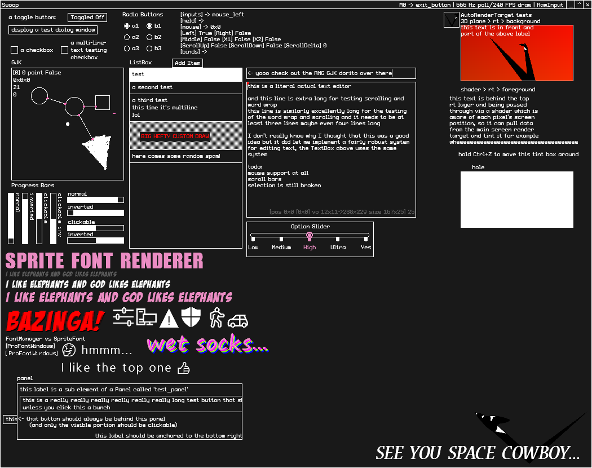

## Swoop

A set of UI elements and systems to manage them, for creating user interfaces. Allows for building things like debug overlays, editor UIs, or even entire applications (a questionable idea).

I intend to implement an invalidation rendering system eventually, but right now there are much bigger performance issues which need to be addressed

Everything is implemented as small ProFont and extreme minimalist 1px bright-lines-on-dark-backgrounds, inspired by BlackBox/bbLean. 

This project will not work as-is and requires MGRawInputLib from [MGRawInput](https://github.com/stencho/MGRawInput) (for handling input and additional things, such as window dragging/resizing and threaded input handling)

#### Implemented UI Elements
- [x] Button
- [x] Check Box
- [ ] Combo Box
- [ ] Cursor
- [x] Dialog Box
- [x] Label
- [ ] List Box
- [ ] Menu/Menu Strip
- [ ] - Menu Bar
- [ ] - Menu Button
- [ ] - Submenu
- [ ] - Menu Toggle
- [ ] - Menu Slider?
- [ ] Numeric Up/Down
- [ ] Multi-choice Option Slider
- [x] Panel
- [x] Progress Bar (+ combined TrackBar)
- [x] Radio Buttons
- [x] Resize Handle
- [ ] Tab Control
- [ ] Text Box
- [x] Title Bar (with window dragging)
- [x] Toggle Button


#### Most current SwoopDemo screenshot



#### Usage:
```csharp
using SwoopLib;

//XYPair is effectively just an integer Vector2, like Point, but with far more functionality
internal static XYPair resolution = new XYPair(800, 600);

void Initialize() {
  Swoop.Initialize(this, resolution);
}

void LoadContent() {
  Swoop.Load(GraphicsDevice, graphics, Content, resolution);
  build_UI();
}

void build_UI() {
  //add a button
  Swoop.UI.add_element(new Button("demo_button", "demo", XYPair.One * 20));

  ((Button)Swoop.UI.elements["demo_button"]).click_action = () => {
    //do something when the button is clicked
  };
}

void Update() {
  Swoop.Update();
}

void Draw() {  
  //Swoop.Draw() draws to Swoop.render_target_output, so that in turn needs 
  //to be drawn to the screen or wherever it's needed
  //If Swoop.fill_background is set to true, the background will be cleared 
  //to Swoop.UI_background_color, otherwise it'll be transparent
  Swoop.Draw();
  GraphicsDevice.SetRenderTarget(null);
  Drawing.image(Swoop.render_target_output, XYPair.Zero, resolution);
}
```

#### Creating elements:
```csharp
public class demo_element : UIElement {
    public demo_element(string name, XYPair position, XYPair size) : base(name, position, size) {
        //if this is enabled, the element will first draw everything in draw_rt()
        //to this.draw_target, then run draw() later
        enable_render_target = true;
        //can be targeted by the focus system
        can_be_focused = true;
        //can still be interacted with when a dialog object is set
        ignore_dialog = false;
    }
    internal override void added() { 
      //occurs after element has had its parent set and has been added to a 
      //UIElementManager's elements array
    }
    internal override void update() { /*update*/ }        
    internal override void draw_rt() {
      //fill element with color
      Drawing.fill_rect(XYPair.Zero, size, Swoop.get_color(this));
    }
    internal override void draw() {          
      //draw the rendertarget to the output
      Drawing.image(draw_target, XYPair.Zero, size);
    }
}
```